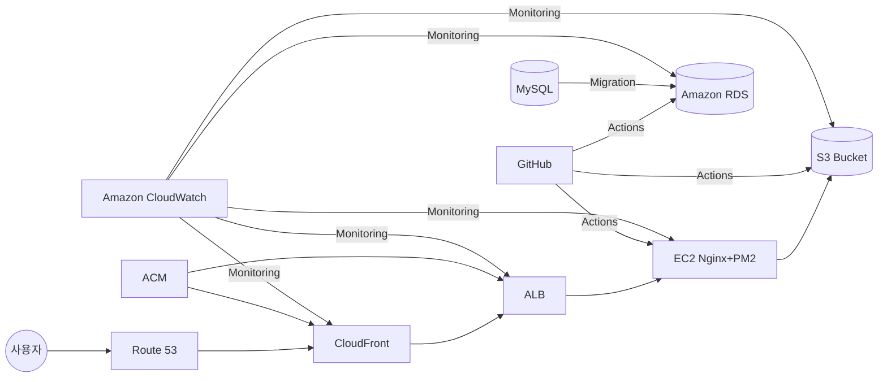
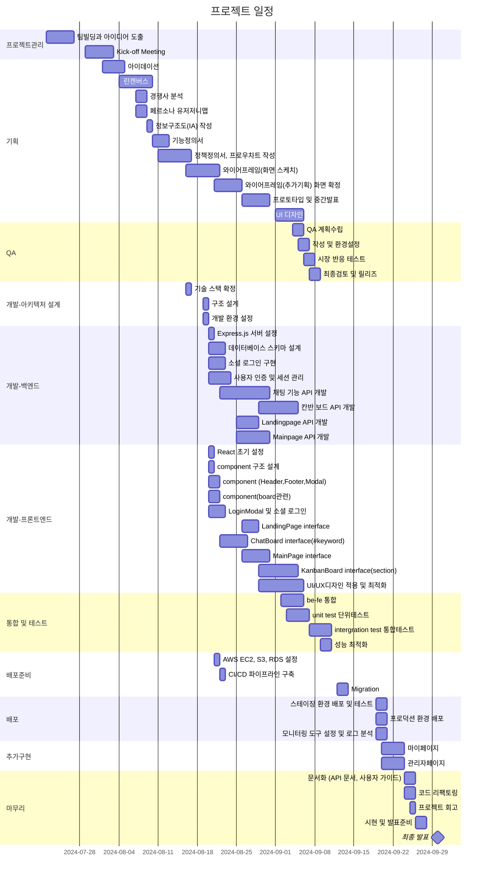
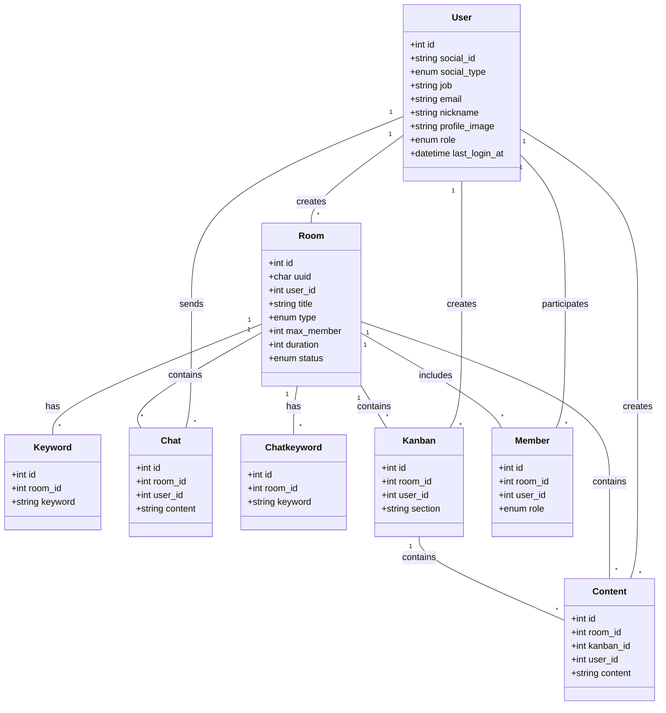
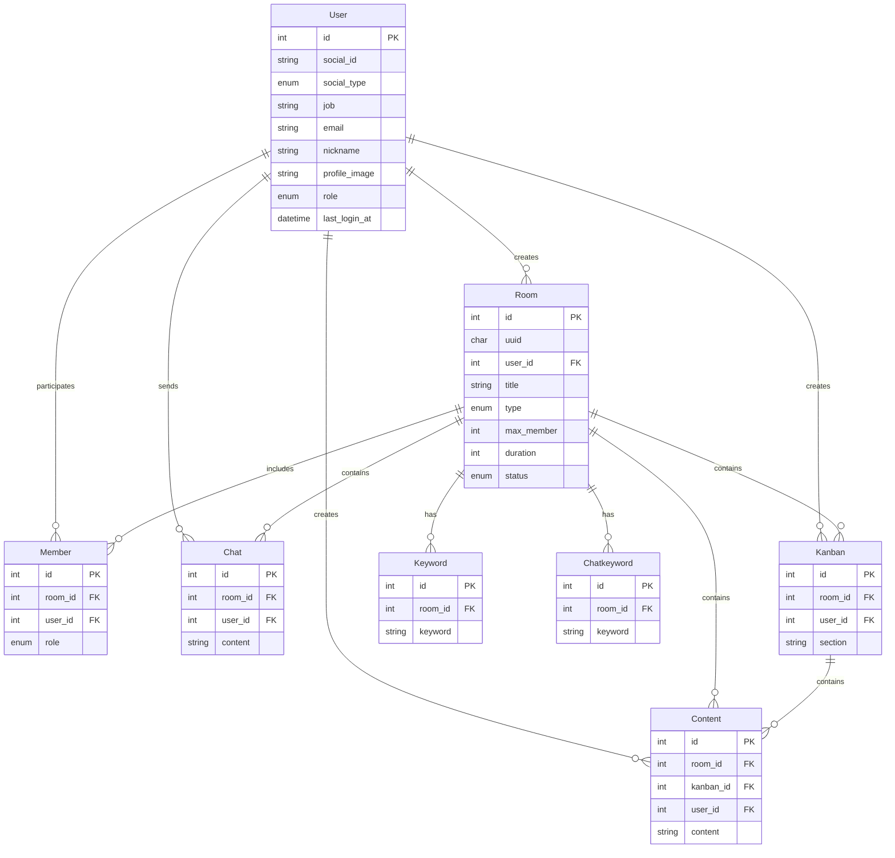

# Razvery - 프론트엔드

"Razvery"는 실시간으로 아이디어를 공유하는 서비스입니다. 제한 시간이 있는 채팅과 포스트잇 보드 형태가 핵심 기능입니다.
<br>
관리자 백오피스 구축으로 직관적인 대시보드로 핵심 지표 실시간 모니터링이 가능하여 사용자 관리가 용이합니다.
<br>

## 팀 소개

- 기획팀: 김상윤, 윤상수
- 개발팀: 박초롱, 변윤석
  <br>

## 프로젝트 기획

- 기능정의서<br>
- 유저저니맵, 페르소나<br>
- 화면흐름도<br>
  <br>

## 기술 스택 및 라이브러리

- Express.js 
- MySQL 

## AWS 배포

url: [Razvery 🍓](https://razvery.link/)<br>



GitHub에서 Action/PM2로 코드 푸시 및 배포<br>
CloudFront는 ACM의 SSL 인증서를 사용해 HTTPS 연결을 제공<br>
MySQL에서 Action/PM2를 통해 데이터 마이그레이션<br>
Action/PM2에서 프론트엔드 파일을 S3 Bucket으로 배포<br>
Action/PM2에서 백엔드 코드를 EC2로 배포<br>
Action/PM2에서 데이터베이스 스키마 및 데이터를 Amazon RDS로 마이그레이션<br>
Amazon CloudWatch를 사용하여 전체 시스템 모니터링<br>

<br>

## WBS



<br>

## 폴더 구조

```bash
server/
├── github/ # GitHub 관련 설정. CI/CD 워크플로우
├── src/
│   ├── config/  # 애플리케이션 설정 파일
│   ├── controllers/    # 요청 처리 및 응답 로직
│   ├── middlewares/    # 미들웨어 함수들
│   ├── models/     # 데이터베이스 모델 및 스키마
│   ├── routes/     # API 라우트 정의
│   ├── passports/  # 인증전략
│   └── utils/      # logger, validator
├── tests/      # 테스트 파일 (TDD를 위한)
├── package.json
└── server.js
```

<br>

## 페이지 및 URL 구조

| 페이지      | URL             | 설명                                       | 주요 기능                                              |
| ----------- | --------------- | ------------------------------------------ | ------------------------------------------------------ |
| LandingPage | /               | 웹사이트의 메인 페이지, 로그인 및 입장하기 | - 서비스 소개<br>- 시작하기 버튼<br>- FAQ              |
| MainPage    | /main           | 로그인 후 메인 대시보드                    | - 사용자의 방 목록<br>- 새 방 만들기                   |
| ChatBoard   | /chat/:roomId   | 베리 톡(채팅방) 페이지                     | - 실시간 채팅<br>- 키워드 표시                         |
| KanbanBoard | /kanban/:roomId | 베리 보드(포스트잇) 페이지                 | - 섹션 별 카드<br>- 드래그 앤 드롭                     |
| MyPage      | /mypage         | 사용자 개인 정보 및 설정 페이지            | - 프로필 수정<br>- 활동 내역 확인                      |
| AboutPage   | /about          | 서비스 소개 및 정보 페이지                 | - 서비스 소개                                          |
| AdminPage   | /admin          | 관리자 페이지                              | - 유저 조회 및 소프트 삭제 <br>- 월별 사용자 유입 통계 |

<br>

## 클래스 다이어그램



<br>

## ERD



<br>

## 트러블 슈팅

- 실시간 양방향 통신: Socket.io를 사용한 실시간 업데이트 구현
- 보안 HTTPS 적용하고 싶었으나 SSL인증서를 발급받지 못했지만 Route53을 시도해 보았음

  <br>

## 회고

<br>
<br>
<br>
````
