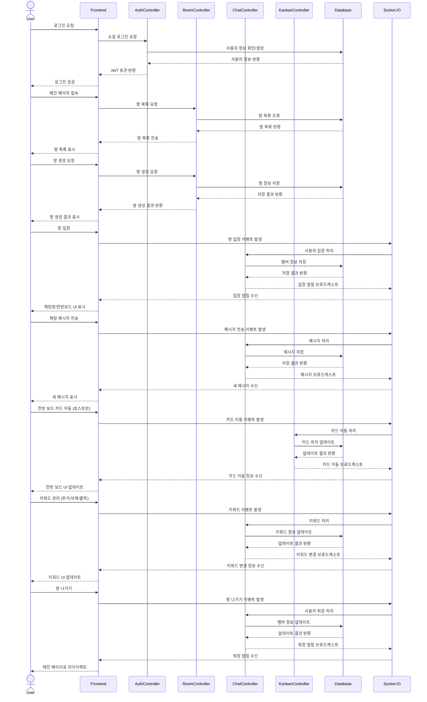
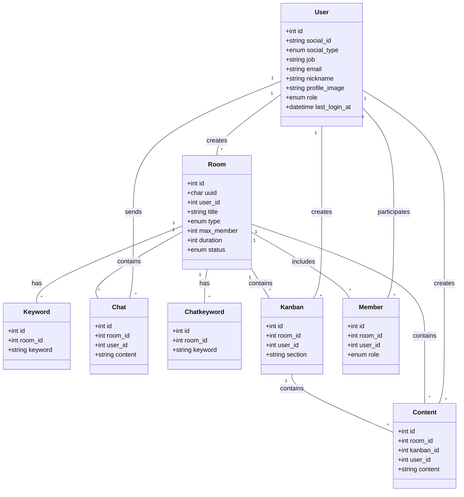
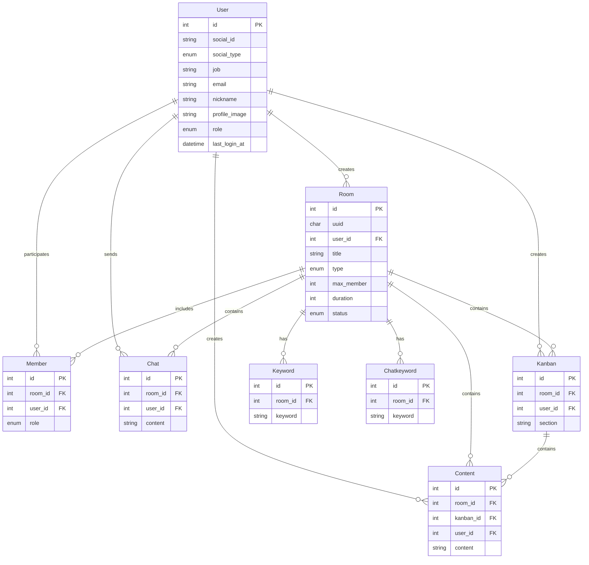
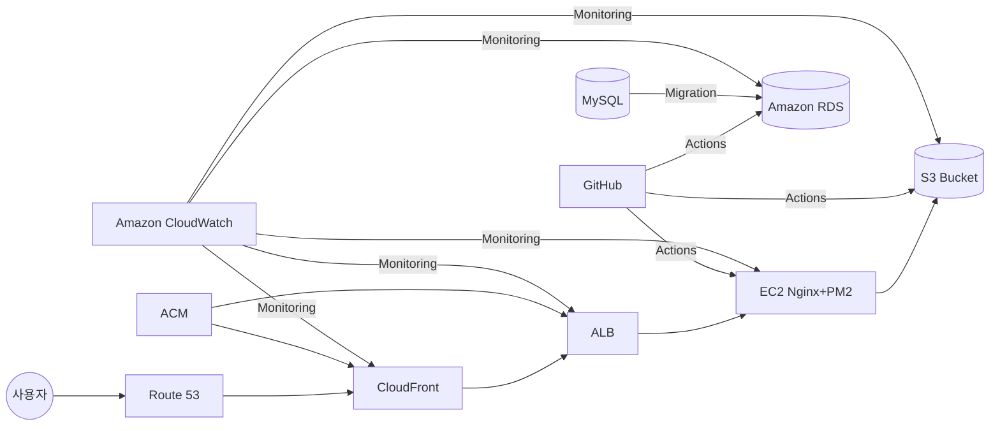

# Razvery - 백엔드

"Razvery"는 실시간으로 아이디어를 공유하는 서비스입니다. 제한 시간이 있는 채팅과 포스트잇 보드 형태가 핵심 기능입니다.
<br>
관리자 백오피스 구축으로 직관적인 대시보드로 핵심 지표 실시간 모니터링이 가능하여 사용자 관리가 용이합니다.
<br>

### 목차

1. 프로젝트 소개
2. 팀 소개 및 링크
3. 프로젝트 기획 (FE)
4. 기술 스택 및 라이브러리
5. 시현 영상 (FE)
6. WBS (FE)
7. 폴더 구조
8. 페이지 및 URL 구조 (FE)
9. 시퀀스 다이어그램 (BE)
10. 클래스 다이어그램 (BE)
11. ERD (BE)
12. AWS 배포 (BE)
13. 트러블 슈팅
14. 회고 (BE)

## 팀 소개

- 기획팀: 김상윤, 윤상수
- 개발팀: 박초롱, 변윤석
  <br>
  링크 <br>
- url: [Razvery 🍓](https://razvery.link/) <br>
- Frontend: https://github.com/obokproject/razvery-fe <br>
- Backend: https://github.com/obokproject/be-test <br>

## 기술 스택 및 라이브러리

- 
- 

<br>

## 폴더 구조

```bash
server/
├── github/ # GitHub 관련 설정. CI/CD 워크플로우
├── src/
│   ├── config/  # 애플리케이션 설정 파일
│   ├── controllers/    # 요청 처리 및 응답 로직
│   ├── middlewares/    # 미들웨어 함수들
│   ├── models/     # 데이터베이스 모델 및 스키마
│   ├── routes/     # API 라우트 정의
│   ├── passports/  # 인증전략
│   └── utils/      # logger, validator
├── tests/      # 테스트 파일 (TDD를 위한)
├── package.json
└── server.js
```

<br>

## 시퀀스 다이어그램



<br>

## 클래스 다이어그램



<br>

## ERD



<br>

## AWS 배포



GitHub에서 Action/PM2로 코드 푸시 및 배포<br>
CloudFront는 ACM의 SSL 인증서를 사용해 HTTPS 연결을 제공<br>
MySQL에서 Action/PM2를 통해 데이터 마이그레이션<br>
Action/PM2에서 프론트엔드 파일을 S3 Bucket으로 배포<br>
Action/PM2에서 백엔드 코드를 EC2로 배포<br>
Action/PM2에서 데이터베이스 스키마 및 데이터를 Amazon RDS로 마이그레이션<br>
Amazon CloudWatch를 사용하여 전체 시스템 모니터링<br>

<br>

## 트러블 슈팅

- 실시간 양방향 통신: Socket.io를 사용한 실시간 업데이트 구현 <br>
- 보안 HTTPS 적용하고 싶었으나 SSL인증서를 발급받지 못했지만 Route53을 시도해 보았음 <br>
  <br>

## 회고

- 박초롱: 이번 프로젝트는 개인적 성장의 측면에서는 배웠던 것 이상의 새로운 기술에 도전하면서 다양한 오류들을 마주했습니다. 많은 오류들을 해결해 나가며 기술적으로 성장할 수 있었고, 문제 해결 능력도 향상되었다고 느꼈습니다. 그리고 기술적인 도전뿐만 아니라 팀워크의 중요성을 동시에 경험할 수 있는 소중한 시간이었습니다. 물론 진행하며 기획팀과 개발팀 간의 '언어의 차이'를 느낀 적이 있었지만, 그럴때마다 팀원들 각자의 영역을 존중하고 어떻게 하면 더 잘 설명할 수 있을까 고민하고 개선해 나갔습니다. 이러한 서로를 보완하고 이해하는 과정들이 저희의 프로젝트의 완성도를 높이는 핵심 요소가 되었다고 생각합니다. <br>
- 변윤석: 프로젝트를 진행하면서 많은 배움을 얻을 수 있었고, 코드 로직에 대한 깊이 있는 이해를 쌓을 수 있는 귀중한 시간이었습니다.
  비록 부족한 부분도 있었지만, 훌륭한 팀원들과의 협업 덕분에 어려운 과제들을 함께 해결하며 끝까지 완성할 수 있었습니다.
  이 과정에서 팀워크의 중요성을 다시 한번 깨닫게 되었고, 앞으로도 성장할 수 있는 기반을 다진 것 같습니다<br>
- 김상윤: 명확한 사용자 페르소나 정의의 중요성과 기획 <br>
- 윤상수: 기획의 ㄱ도 모르는 상태로 시작했지만 하나의 결과물이 나와버렸습니다. 이게 되나 싶었는데 되네요.
  팀원 모두 처음 하시는 분들인데 너무 잘 해주셨고 덕분에 저도 생각 이상으로 해낼 수 있었던 것 같습니다.<br>
  <br>
  <br>
